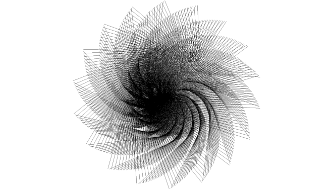

# graphw

graphw is a C++ library for graph drawing and network analysis. The library implements various algorithms to construct, analyze, and model complex networks.

## Getting Started

### Dependencies

Install [SDL2](http://libsdl.org/download-2.0.php) to draw graphs.

### Installation

1.  Download the headers in [`graphw/`](https://github.com/claby2/graphw/tree/master/graphw).
2.  Either put the header files in a central location (with a specified path) or directly in your project tree.

Documentation can be found in [`docs/`](./docs/readme.md).

### Building

```console
$ cmake .
$ make
```

## Examples

### Basic example

A simple example that constructs and models a graph in a circular layout.

```cpp
#include <graphw/graphw.hpp>
#include <graphw/graphw_draw.hpp>

int main() {
    graphw::CircularLayout g;
    g.add_edge("a", "b");
    g.add_edge("b", "c");
    g.add_edge("c", "a");
    graphw::draw(g);
}
```

### Spiral layout example

Example of a balanced tree in a spiral layout.

```cpp
#include <graphw/graphw.hpp>
#include <graphw/graphw_draw.hpp>

int main() {
    graphw::SpiralLayout g;
    g.set_node_radius(0);
    g.add_balanced_tree(2, 10);
    graphw::draw(g);
}
```



### Additional examples

More examples can be found in [`examples/`](https://github.com/claby2/graphw/tree/master/examples).

## Benchmarking

Benchmarking does not require any external dependencies.

Compile with:

```console
$ make benchmark
```

## Testing

Testing requires [Catch2](https://github.com/catchorg/Catch2/).

Compile with:

```console
$ make test
```
